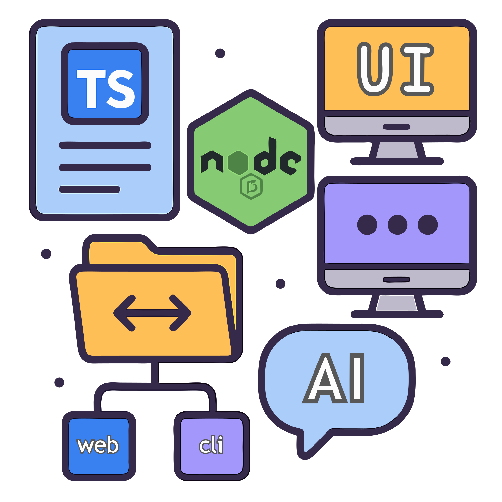

<div align="center">

<h1>Starter Monorepo</h1>

<h3>Monorepo is amazing!</h3>


</div>

# starter-monorepo

* [starter-monorepo](#starter-monorepo)
  * [Overview](#overview)
  * [What's inside?](#whats-inside)
    * [Overview of the tech](#overview-of-the-tech)
    * [Highlight Features / Components](#highlight-features--components)
      * [AI / LLM Chat](#ai--llm-chat)
    * [Apps and Libraries](#apps-and-libraries)
      * [`frontend`: a Nuxt app, compatible with v4 structure.](#frontend-a-nuxt-app-compatible-with-v4-structure)
      * [`backend`: a Hono🔥 app.](#backend-a-hono-app)
      * [`backend-convex`: a Convex app.](#backend-convex-a-convex-app)
    * [Local packages](#local-packages)
    * [Utilities](#utilities)
    * [Build](#build)
    * [Develop](#develop)
      * [Wrangler / Cloudflare Workers (Local dev via workerd)](#wrangler--cloudflare-workers-local-dev-via-workerd)
      * [IMPORTANT:](#important)
    * [Deploy](#deploy)
    * [Notes](#notes)
      * [`import` ordering](#import-ordering)
      * [Dev with SSL](#dev-with-ssl)
    * [Turborepo Remote Caching](#turborepo-remote-caching)
  * [Useful Links](#useful-links)
    * [Turborepo](#turborepo)
    * [grammY](#grammy)

## Overview

This is a base monorepo starter template to kick-start your beautifully organized project, whether its a fullstack project, monorepo of multiple libraries and applications, or even just one API server and its related infrastructure deployment and utilities.

Out-of-the-box with the included apps, we have a fullstack project: with a `frontend` Nuxt 4 app, a main `backend` using Hono, and a `backend-convex` Convex app.
  * General APIs, such as authentication, are handled by the main `backend`, which is designed to be serverless-compatible and can be deployed anywhere, allowing for the best possible latency, performance, and cost, according to your needs.
  * `backend-convex` is an optional, modular/add-in backend, utilized to power components like `AI Chat`.

It is recommended to use an AI Agent ([`Roo Code`](https://github.com/RooVetGit/Roo-Code) recommended) to help you setup the monorepo according to your needs, see [Utilities](#utilities)

## What's inside?

### Overview of the tech

⏩ This template is powered by [Turborepo](https://turbo.build/repo).

😊 Out-of-the-box, this repo is configured for an SSG `frontend` Nuxt app, and a `backend` Hono app that will be the main API, to optimize on cost and simplicity.
- You can change the `apps/frontend`'s `build` script to `nuxt build` to enable SSR bundle, but some features like authentication will require manual upgrade by you.

🌩️ [SST Ion](https://ion.sst.dev/), an Infrastructure-as-Code solution, with powerful [Live](https://ion.sst.dev/docs/live/) development.  
- SST is 100% opt-in, by using `sst` CLI commands yourself, like `sst dev`,  
  simply remove `sst` dependency and `sst.config.ts` if you want to use another solution.
- *currently only `backend` app is configured, which will deploy a Lambda with Function URL enabled*

🔐 Comes with authentication boilerplate via [**WorkOS AuthKit**](https://workos.com/), see: `/apps/backend/api/auth`
- *Add your env variables, DONE!*
- Please note that by default `backend` comes with a cookies-based session manager, which have great DX, security and does not require an external database (which also means great performance), but as the `backend` is decoupled with the Nuxt's SSR server, it will not work well with SSR (the session/auth state is not shared).  
So, if you use SSR, you should implement another auth solution.
  - If you have a good session manager implementation, a PR is greatly appreciated!

💯 JS is always [**TypeScript**](https://www.typescriptlang.org/) where possible.

### Highlight Features / Components

#### AI / LLM Chat

> Done as an application for [**T3 Chat Cloneathon**](https://cloneathon.t3.chat/) competition in 1 week, with no prior AI SDK and chat streams experience, but I think I did an amazing job 🫡!
> 
> The focus of the project is for broad, group-use adoption, prioritizing easy-to-access UI/UX, bleeding-edge features like workflows are a low prio, though, advanced capabilities per-model capabilities and fine-tuning are still expected to be elegantly supported via the model's interface. #48

<details>
  <summary>A simple & friendly LLM Chat system, but still packing some powers, featuring:</summary>

  * `hosted` provider that you can control the billing of.
  * Supports other add-in **BYOK** providers, like `OpenAI`, `OpenRouter`,...
  * Seamless authentication integration with the main `backend`.
  * Beautiful syntax highlighting 🌈.
  * Thread branching, freezing, and sharing.
  * Real-time, multi-agents, multi-users support ¹.
    * Invite your families and friends, and play with the Agents together in real-time.
    * Or maybe invite your colleagues, and brainstorm together with the help and power of AI.
  * Resumable and multi-streams ¹.
    * Ask follow-up questions while the previous isn't done, the model is able to pick up what's available currently 🍳🍳.
    * Multi-users can send messages at the same time 😲😲.
  * Easy and private: guest, anonymous usage supported.
    * Your dad can just join and chat with just a link share 😉, no setup needed.
  * Mobile-friendly.
  * Fast ⚡ with local caching and optimistic updates.
  * Designed to be scalable
    * > Things are isolated and common interfaces are defined and utilized where possible, there's no tightly coupled-hacks that prevents future scaling, things just works, elegantly.
    * Any AI provider that is compatible with `@ai-sdk` interface can be added in a few words of code, I just don't want to bloat the UI by adding all of them.

`*1`: currently the "stream" received when resuming or for other real-time users in the same thread is implemented via a polling, not SSE. it is intentionally chosed to be this way for more minimal infrastructure setup and wider hosting support, so smaller user groups can host their own version easily, it is still very performant and efficient.
  * There is boilerplate code for SSE resume support, you can simply add a pub-sub to the backend and switch to using SSE resume in `ChatInterface` component.
</details>

### Apps and Libraries

#### [`frontend`](./apps/frontend): a [Nuxt](https://nuxt.com/) app, compatible with v4 structure.
  * By default, the frontend `/api/*` routes is proxied to the `backendUrl`.
  * The `rpcApi` plugin will call the `/api/*` proxy if they're on the same domain but different ports (e.g: 127.0.0.1)
    * > this mimics a production environment where the static frontend and the backend lives on the same domain at /api, which is the most efficient configuration for Cloudfront + Lambda Function Url, or Cloudflare Workers.
    * If the `frontend` and `backend` are on different domains then the backend will be called directly without proxy.
    * This could be configured in frontend's [`app.config.ts`](./apps/frontend/app/app.config.ts)

#### [`backend`](./apps/backend): a [Hono🔥](https://hono.dev/) app.

#### [`backend-convex`](./apps/backend-convex): a [Convex](https://convex.dev/) app.

### Local packages

+ [`@local/locales`](./locals/locales/README.md): a shared central locales/i18n data library powered by [**spreadsheet-i18n**](https://github.com/NamesMT/spreadsheet-i18n--mono).
  + 🌐✨🤖 **AUTOMATIC** localization with AI, powered by [**lingo.dev**](https://lingo.dev/), just `pnpm run i18n`.
  + 🔄️ Hot-reload and automatic-reload supported, changes are reflected in apps (`frontend`, `backend`) instantly.
+ `@local/common`: a shared library that can contain constants, functions, types.
+ `@local/common-vue`: a shared library that can contain components, constants, functions, types for vue-based apps.
+ `tsconfig`: `tsconfig.json`s used throughout the monorepo.

### Utilities

This Turborepo has some additional tools already setup for you:
+ 🧐 ESLint + stylistic formatting rules ([antfu](https://github.com/antfu/eslint-config))
+ 📦📢 [`repo-release`](https://github.com/namesmt/repo-release) script, easily generates changelog, bump version, create GitHub release, and publish your packages to npm.
+ 📚 A few more goodies like:
  + [lint-staged](https://github.com/lint-staged/lint-staged) pre-commit hook
  + 🤖 Initialization prompt for AI Agents to modify the monorepo according to your needs.
    * To start, open the chat with your AI Agent, and include the [`INIT_PROMPT.md`](./INIT_PROMPT.md) file in your prompt.

### Build

To build all apps and packages, run the following command:  
`pnpm run build`

### Develop

If you just want a quick check out, without having to set up anything, you can use `pnpm run dev:noConvex`, this will skips `backend-convex`, which is the only component that have initial set ups, though, this of course means related features are disabled (AI Chat).

To develop all apps and packages, run the following command:  
`pnpm run dev`

For local development environment variables / secrets, create a copy of `.env.dev` to `.env.dev.local`.

#### Wrangler / Cloudflare Workers (Local dev via workerd)

Guide to setup local development for Cloudflare `workerd` runtime testing:
* (Optional) Run the convex dev server if you use convex.
* Config `wrangler.jsonc`, specfically, the `vars` block, so that it properly targets the local env.
* (Optional) Config [`apps/frontend/.env.workerd.dev`](apps/frontend/.env.workerd.dev) if you use convex or use different ip/port.
* Build a new static dist for local dev:
  * Start the local `backend` server
  * Run `build:workerdLocal` script for `frontend`.
* Run `pnpm dlx wrangler dev` to start wrangler dev server.
  * `workerd` does not work with Alpine Linux, so if you use the included Dev Container, change the base image to some other distro.

#### IMPORTANT:

For the best development experience, for VSCode and its forks, you should use the workspace's TypeScript version instead of VSCode's shipped version, to do this, open any file with TypeScript support like `.ts`, `.vue`, then, from the IDE's command palette, run the "TypeScript: Select TypeScript Version" and choose "Use Workspace Version".

### Deploy

* You can add your custom deploy instructions in `deploy` script and `scripts/deploy.sh` in each app, it could be a full script that deploys to a platform, or necessary actions before for some platform integration deploys it, `frontend` will only start [build and deploy after all backends are deployed](./apps/frontend/turbo.json), to have context for SSG.
* The repo also contains some deployment presets samples:
  + [Action to deploy frontend to GitHub Pages](./.github/workflows/frontend-to-gh-pages.yml)
  + [Wrangler configured to deploy fullstack to Cloudflare](./wrangler.jsonc), just run `npx wrangler deploy` or connect and deploy it through the Cloudflare Dashboard.
    + Wrangler will deploy `backend` and `frontend` at the same time, which might cause `frontend` to have old context for SSG, you should trigger a redeploy in such case.
  + [Deploy backend to Lambda via SST](./sst.config.ts)
+ Some more deploying notes:
  + To enable deploy with Convex in production, simply rename `_deploy` script to `deploy` in `backend-convex` app, run the deploy script once manually to get the Convex's production url, set it to `NUXT_PUBLIC_CONVEX_URL` env in `frontend`'s `.env.prod` file or CI / build machine env variable.

### Notes

#### `import` ordering

Imports should not be separated by empty lines, and should be sorted automatically by eslint.

#### Dev with SSL

The project comes with a `localcert` SSL at `locals/common/dev` to enable HTTPS for local development (because some 3rd-party services require local dev to have HTTPS, so I enable it by default), generated with [mkcert](https://github.com/FiloSottile/mkcert), you can install mkcert, generate your own certificate and replace it, or install the `localcert.crt` to your trusted CA to remove the untrusted SSL warning.

### Turborepo Remote Caching

Turborepo can use a technique known as [Remote Caching](https://turbo.build/repo/docs/core-concepts/remote-caching) to share cache artifacts across machines, enabling you to share build caches with your team and CI/CD pipelines.

By default, Turborepo will cache locally. To enable Remote Caching you will need an account with Vercel. If you don't have an account you can [create one](https://vercel.com/signup), then enter the following commands:

```
npx turbo login
```

This will authenticate the Turborepo CLI with your [Vercel account](https://vercel.com/docs/concepts/personal-accounts/overview).

Next, you can link your Turborepo to your Remote Cache by running the following command from the root of your Turborepo:

```
npx turbo link
```

## Useful Links

Learn more about the tech of the repo:

### Turborepo

- [Tasks](https://turbo.build/repo/docs/core-concepts/monorepos/running-tasks)
- [Caching](https://turbo.build/repo/docs/core-concepts/caching)
- [Remote Caching](https://turbo.build/repo/docs/core-concepts/remote-caching)
- [Filtering](https://turbo.build/repo/docs/core-concepts/monorepos/filtering)
- [Configuration Options](https://turbo.build/repo/docs/reference/configuration)
- [CLI Usage](https://turbo.build/repo/docs/reference/command-line-reference)

### grammY

[https://grammy.dev](https://grammy.dev)
